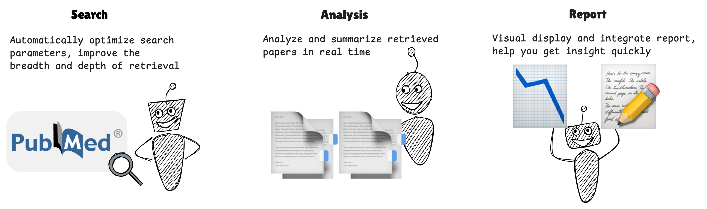
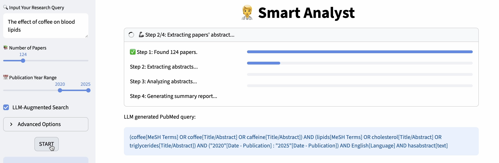
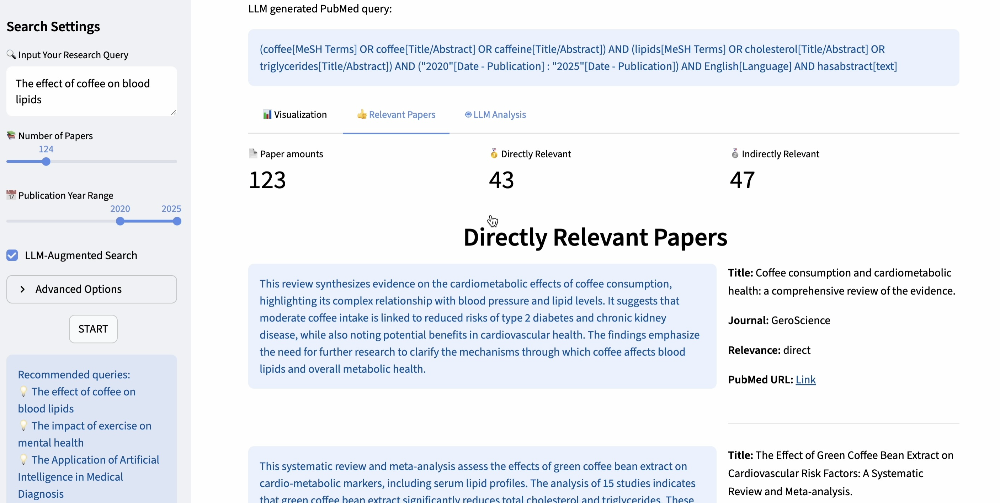
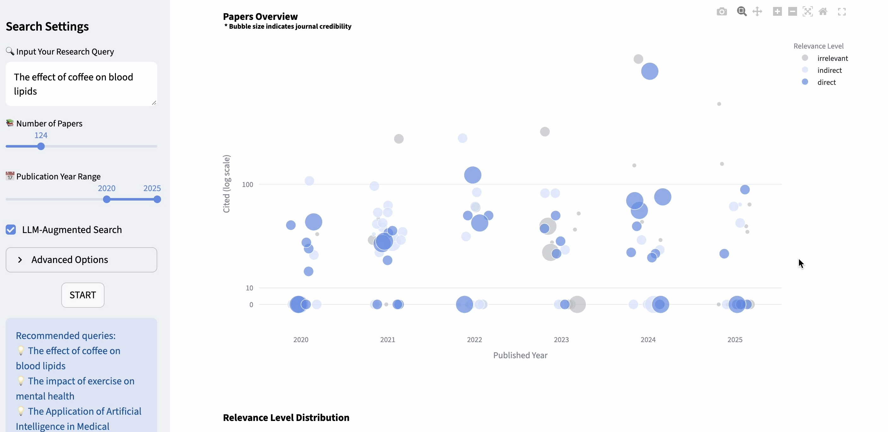
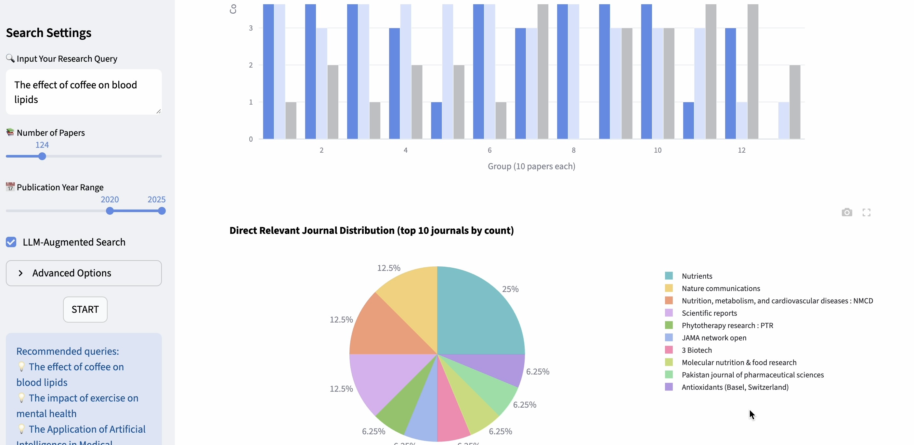
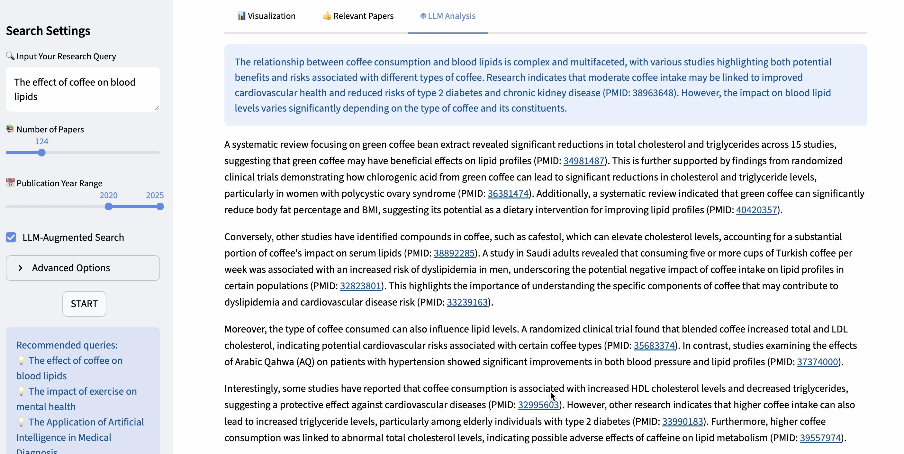

<h1 align="center">agent Medical Paper Analyst</h1>

### Web link
Try with your OpenAI API key:
https://dlbb-w-agentmedical-visualization-en-vzlhnq.streamlit.app/

### Workflow
1.LLM generates professional medical terminology to search on PubMed

2.LLM determines whether the retrieved papers are relevant to the user's query, provides a brief summary, and visualizes the search results

3.LLM generates the final analysis report

### Video display
https://youtu.be/-qSq3hbOkmQ
