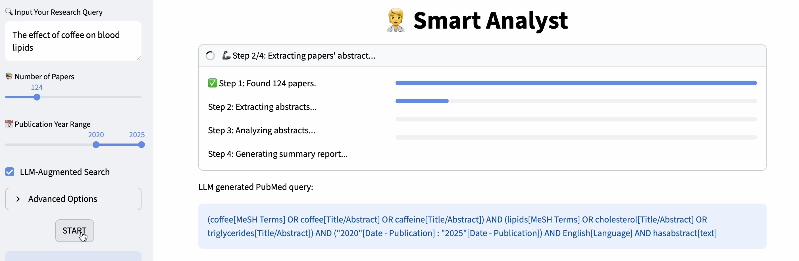
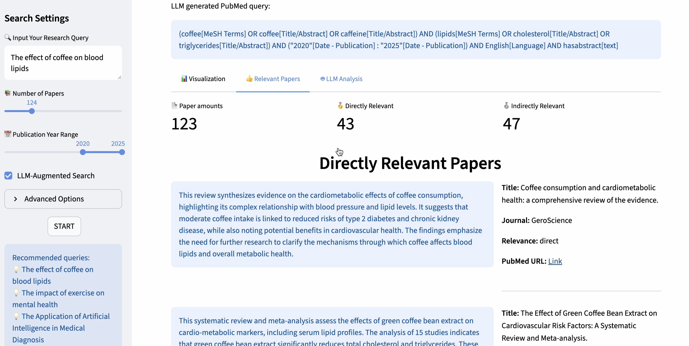
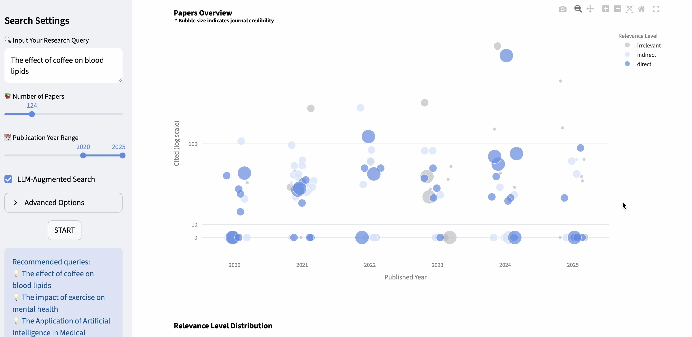
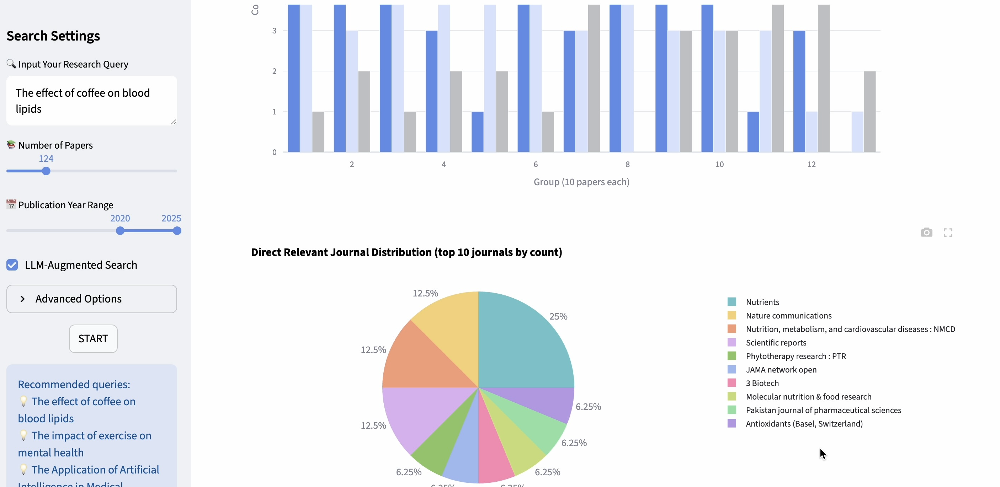
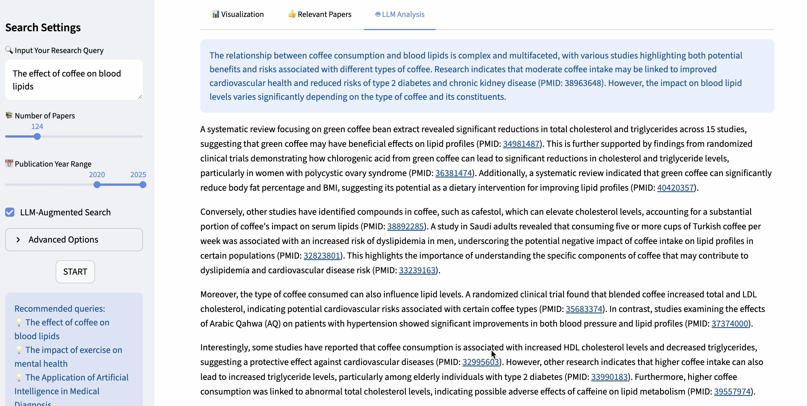
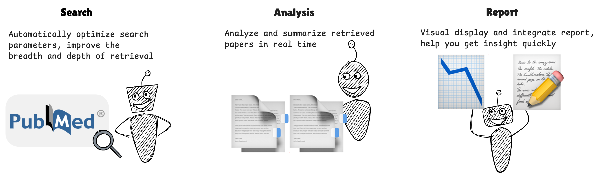

<h1 align="center">agent Medical Paper Analyst</h1>

### Workflow
1.LLM generates professional medical terminology to search on PubMed

2.LLM determines whether the retrieved papers are relevant to the user's query, provides a brief summary, and visualizes the search results

3.LLM generates the final analysis report

### Video display
[YouTube](https://youtu.be/-qSq3hbOkmQ)
[bilibili](https://www.bilibili.com/video/BV1xqziB3Ex4/?vd_source=d0fa9cc20429329c68e1272c0c67189e)

### Web link
https://agentmpaper.streamlit.app/ (Try with your API for OpenAI and PubMed)

